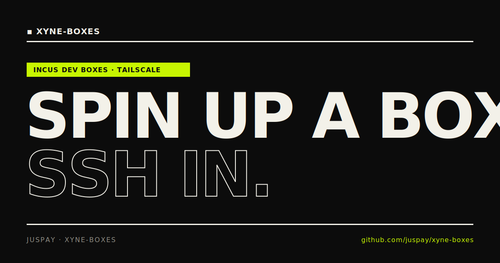

<div align="center">



# xyne-boxes

**Remote Linux dev boxes, one SSH away.**

### → [Setup &amp; usage guide](https://juspay.github.io/xyne-boxes/)

</div>

---

Everything you need to create and access a box lives on the
**[website](https://juspay.github.io/xyne-boxes/)**.

## Commands

```
nix run https://github.com/juspay/xyne-boxes/archive/main.zip <command>
```

| Command | Description |
| --- | --- |
| `create <name>` | Create a box |
| `fork <source> <name>` | Fork an existing box |
| `connect <name>` | SSH into a box |
| `destroy <name> [name ...]` | Destroy one or more boxes |
| `list` | List your boxes |
| `version` | Print `bash`, `ssh`, and `step-cli` versions |

## Support

Questions or feedback? Join `#xyne-boxes-feedback` on Xyne Spaces.

## The website

The site in [`site/`](site/) deploys to GitHub Pages via
[`.github/workflows/pages.yml`](.github/workflows/pages.yml).
