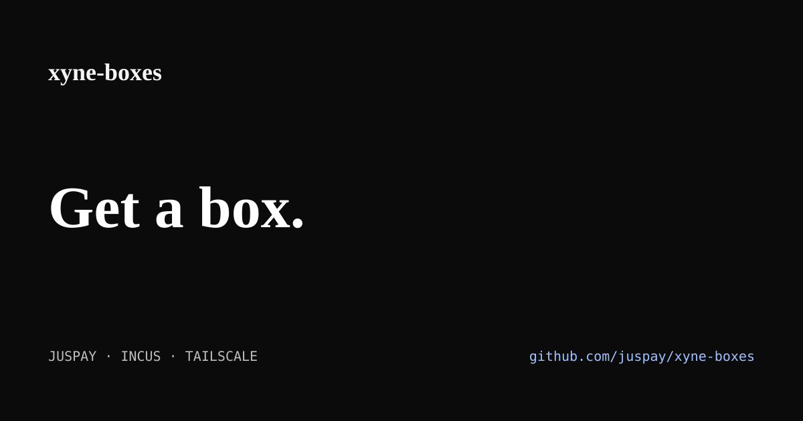

<div align="center">



# xyne-boxes

**Remote Linux dev boxes, one SSH away.**

### → [Setup &amp; usage guide](https://juspay.github.io/xyne-boxes/)

</div>

---

Everything you need to create and access a box lives on the
**[website](https://juspay.github.io/xyne-boxes/)**.

On a pristine Mac (Apple Silicon) or Linux x86_64, no Nix:

```
curl -fsSL https://raw.githubusercontent.com/juspay/xyne-boxes/nightly/installer/install.sh | sh
```

## Commands

```
nix run https://github.com/juspay/xyne-boxes/archive/main.zip <command>
xyne-boxes <command>   # after the curl installer
```

| Command | Description |
| --- | --- |
| `create <name>` | Create a box |
| `fork <source> <name>` | Fork an existing box |
| `connect <name>` | SSH into a box |
| `destroy <name> [name ...]` | Destroy one or more boxes |
| `list` | List your boxes |
| `version` | Print package, commit, bun, ssh, and step-cli versions |

`nix run` ships **bun**, **openssh**, and **step-cli**. A new machine only needs [Nix](https://juspay.github.io/nixone/).

## Library

```ts
import { Client } from "xyne-boxes"
import { Effect } from "effect"
import { NodeServices } from "@effect/platform-node"

const program = Effect.gen(function* () {
  const client = yield* Client.make()
  const listed = yield* client.list()
  const ssh = yield* client.sshConfig("mybox")
  return { listed, ssh }
}).pipe(Effect.provide(NodeServices.layer))
```

Connecting is CLI-only (`xyne-boxes connect`). The library returns SSH config; the caller runs `ssh`.

## Support

Questions or feedback? Join `#xyne-boxes-feedback` on Xyne Spaces.

## The website

The site in [`site/`](site/) deploys to GitHub Pages via
[`.github/workflows/pages.yml`](.github/workflows/pages.yml).
