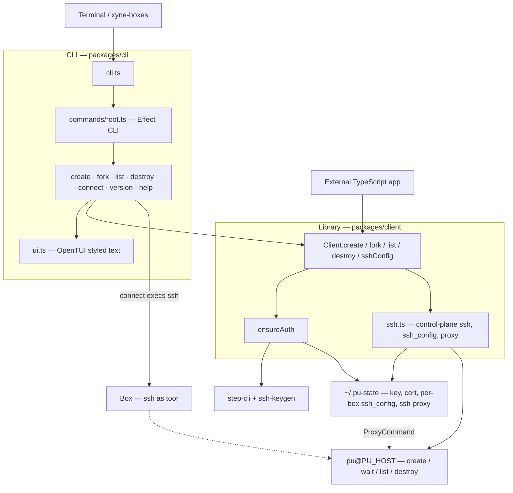

# xyne-boxes

TypeScript client for [xyne-boxes](https://juspay.github.io/xyne-boxes/). Effect library plus the `xyne-boxes` CLI.

The library never spawns `ssh`. It creates, forks, lists, and destroys boxes, and returns SSH config. The CLI is what execs `ssh`.



External apps import `Client` and stay in Effect. The CLI parses argv, calls the same `Client`, and is the only thing that `exec`s `ssh`. Every mutating call goes through `ensureAuth` first.

## Library

Peers: `effect` and `@effect/platform-node` (4.0.0-rc.110). Bun can import this package from source.

```ts
import { Client, sshArgv } from "xyne-boxes"
import { Effect } from "effect"
import { NodeServices } from "@effect/platform-node"

const program = Effect.gen(function* () {
  const client = yield* Client.make()
  yield* client.create("mybox")
  const listed = yield* client.list()
  const ssh = yield* client.sshConfig("mybox")
  // ssh.sshArgs, ssh.proxyCommand, ssh.configPath, sshArgv(ssh, { remoteCmd })
  return { listed, ssh }
}).pipe(Effect.provide(NodeServices.layer))
```

`Client.make({ host, admin, useSshCa, stateDir, … })` overrides the `PU_*` / `STEP_*` env defaults.

| Method | Result |
| --- | --- |
| `create(name)` / `fork(source, name)` | `{ name }` after the box is ready |
| `list()` | raw listing from the control plane |
| `destroy(names)` | control-plane output; local state for those names is removed |
| `sshConfig(name)` | identity, proxy, `ssh_config` path, and argv prefix |
| `ensureAuth()` | cert / key material used by the methods above |

Errors are tagged: `UsageError`, `AuthError`, `MissingTool`, `CommandFailed`.

## CLI

The terminal is [`packages/cli`](../cli/). How to install and run it: [usage guide](https://juspay.github.io/xyne-boxes/).
